# Job-Portal

🔗 **Live Demo:** https://job-portal-126.pages.dev/

A full-stack Job Portal built with a headless Laravel REST API and a React frontend. The platform supports four distinct user roles — Admin, Sub-Admin, Recruiter, and Job Seeker — each with scoped access enforced through custom middleware. The backend features a custom JWT implementation (HMAC-SHA256, no third-party library), OTP-based email verification, a three-layer Service → Repository → DAO architecture for clean separation of concerns, and Laravel Events and Listeners for decoupled side effects. The frontend is built with React, TanStack Query, Tailwind CSS, and shadcn/ui.

## Architecture

The backend follows a strict three-layer architecture to keep concerns cleanly separated:

```
HTTP Request
     │
     ▼
 Controller        ← validates input, calls Service, returns response
     │
     ▼
  Service          ← all business logic lives here
     │
     ▼
 Repository        ← plain Eloquent queries only, always returns Collections
     │
     ▼
    DAO             ← maps raw query results to plain data objects
```

**Controller** — Thin layer responsible only for request validation and response formatting. No business logic.

**Service** — Owns all business rules (e.g. duplicate application checks, OTP expiry, access rights validation). Has no knowledge of Eloquent or the database.

**Repository** — Contains only raw database queries using Eloquent. Always returns a `Collection` or a single model. Never applies business rules.

**DAO (Data Access Object)** — Maps Eloquent results to plain PHP objects, decoupling the rest of the application from the database schema.

This separation means each layer can be tested independently — Services can be unit tested with mocked Repositories, and Repositories can be tested against a real database without involving business logic.

## Features

* **Custom JWT Authentication:** JWT tokens generated and verified from scratch using HMAC-SHA256 — no third-party JWT library used.
* **OTP Email Verification:** Users verify their email address via a time-sensitive OTP during registration before gaining access.
* **Role-Based Access Control:** Four roles — Admin, Sub-Admin, Recruiter, and Job Seeker — enforced per route via custom middleware.
* **Job Management:** Recruiters can create, edit, publish, and delete job postings with full details including category, salary range, and location.
* **Application Lifecycle Tracking:** Applications move through a defined status workflow — Pending → Reviewed → Shortlisted → Hired or Rejected — with optional recruiter messages at each step.
* **Recruiter–Seeker Messaging:** Recruiters can send messages to candidates when updating application status, stored and displayed in the application history timeline.
* **Job Seeker Profiles:** Seekers build rich profiles with work experience, education, skills, headline, summary, resume upload, and social links.
* **Resume Upload:** PDF/DOC resume upload handled via Laravel's filesystem, accessible to recruiters during application review.
* **Saved Jobs:** Job seekers can save and manage a personalised list of job postings.
* **Notifications:** In-app notification system with unread count tracking and mark-read support (single or bulk).
* **Admin Dashboard:** Platform-wide statistics, user management, status toggling, and sub-admin creation.
* **Recruiter Dashboard:** Overview of active job postings, application counts, and candidate pipeline management.
* **Forgot / Reset Password:** OTP-based password reset flow with email delivery.
* **Change Password:** Authenticated users can change their password with current-password verification.

## Functionality

* **Registration:** Users register with name, email, and password. An OTP is sent to the provided email for verification. A signed JWT is issued on successful verification.
* **Login:** Credentials are validated, a JWT is signed and returned, and the user's last login timestamp is recorded.
* **Logout:** Clears the token from localStorage and records the logout time.
* **Job Posting:** Recruiters draft and publish jobs with structured details. Draft jobs are not visible to seekers until published.
* **Applying for Jobs:** Seekers apply with a cover letter, expected salary, experience, and notice period. Duplicate applications are prevented.
* **Application Workflow:** Recruiters advance or reject applicants. Each status change optionally attaches a recruiter note delivered as a notification to the seeker.
* **Profile Building:** Seekers maintain experience entries (with current-job support), education records, skills list, and professional summary — all individually updatable.
* **Access Rights:** Admins configure per-user access rights, stored and checked independently of the role system for granular control.
* **Application History:** Full timeline of status transitions, recruiter notes, and timestamps visible to both recruiter and seeker.

## Security

* **Password Hashing:** All passwords are hashed with bcrypt before storage — plain text is never persisted.
* **Password Strength:** Minimum 8 characters with uppercase, lowercase, numeric, and special character requirements enforced at the API layer.
* **Custom JWT:** Tokens are signed with HMAC-SHA256 using a server-side secret. Signature verification and expiry checks are performed on every protected request.
* **Token Storage:** The JWT is stored in localStorage on the client and attached to every request via the Authorization header as a Bearer token.
* **OTP Verification:** Email OTP verification gates account activation during registration and password reset.
* **Role Middleware:** Every protected route checks both the JWT and the user's role. Privilege escalation across roles is blocked at the middleware level.
* **Rate Limiting:** Login, registration, OTP, and password reset routes are throttled to resist brute-force and enumeration attacks.

## Built With

[](https://skillicons.dev)

## Usage

To run this project locally, follow these steps:

1. Clone the repository:

   ```bash
   git clone https://github.com/DikshaGowda007/job-portal.git
   cd job-portal
   ```

2. Set up the backend:

   ```bash
   cd backend
   composer install
   cp .env.example .env
   php artisan key:generate
   php artisan migrate --seed
   ```

3. Configure `backend/.env`:

   ```env
   DB_DATABASE=your_database
   DB_USERNAME=your_username
   DB_PASSWORD=your_password
   MAIL_MAILER=smtp
   MAIL_HOST=your_mail_host
   MAIL_USERNAME=your_email
   MAIL_PASSWORD=your_password
   JWT_SECRET=your_jwt_secret
   ```

4. Start the backend server:

   ```bash
   php artisan serve
   ```

5. Set up the frontend:

   ```bash
   cd ../frontend
   npm install
   ```

6. Configure `frontend/.env`:

   ```env
   VITE_API_BASE_URL=http://localhost:8080
   ```

7. Start the frontend:

   ```bash
   npm run dev
   ```

## What Did I Learn

* **Custom JWT from Scratch:** Built JWT generation and verification manually using HMAC-SHA256 without any library — deepened understanding of how token signing, encoding, and expiry validation actually work.
* **Service → Repository → DAO Architecture:** Business logic lives exclusively in Service classes, which delegate all database access to Repositories. Repositories return plain Eloquent Collections using DAO objects — keeping Services fully decoupled from Eloquent and making the codebase independently testable at each layer.
* **Role-Based Access Control:** Designed and implemented a multi-role system with per-route middleware enforcement, giving each user type a scoped set of capabilities without duplicating logic.
* **Laravel Events and Listeners:** Used the event system to decouple notification dispatch and email sending from core application logic — for example, withdrawal notifications fire as a side effect of a status change, not inline code.
* **JWT Token Storage:** Stored JWT in localStorage and injected it as a Bearer token via an Axios interceptor — understanding the tradeoffs between localStorage and HTTP-only cookies for token security.
* **OTP Email Verification:** Implemented time-sensitive OTP flows for both registration and password reset using Laravel's mail system and a dedicated verification table.
* **TanStack Query (React Query):** Managed all server state on the frontend with React Query — handled caching, background refetching, and mutation invalidation without any global state library.
* **Tailwind CSS + shadcn/ui:** Built a fully responsive, accessible UI using utility-first CSS and a headless component library, keeping styling consistency across the application.
* **FormRequest Validation:** Centralised all input validation in dedicated FormRequest classes, keeping controllers thin and validation logic reusable and testable.
* **File Uploads with Laravel Storage:** Handled secure resume uploads with MIME type validation, storing files via Laravel's filesystem abstraction and serving them through storage links.

## Screenshots

### Public Home Page
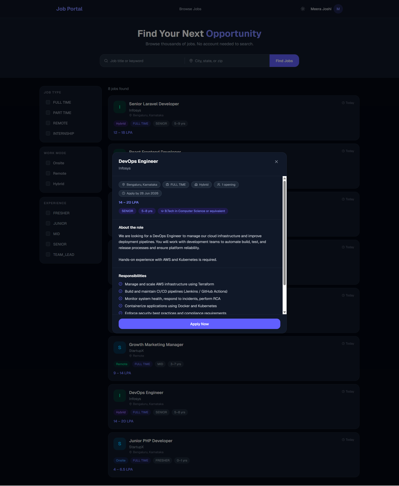

### Job Detail Modal
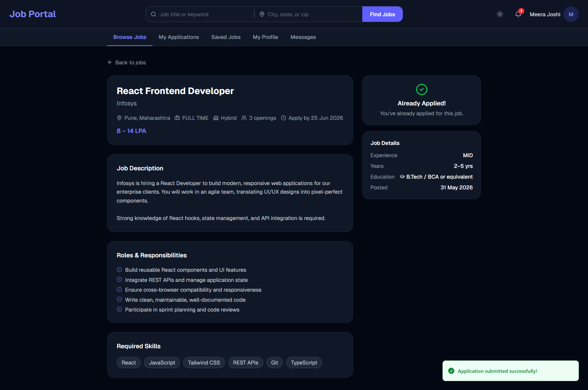

### Login Page
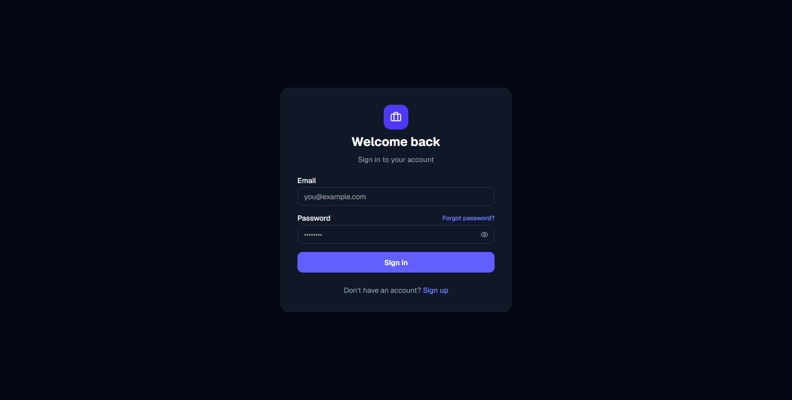

### Signup Page
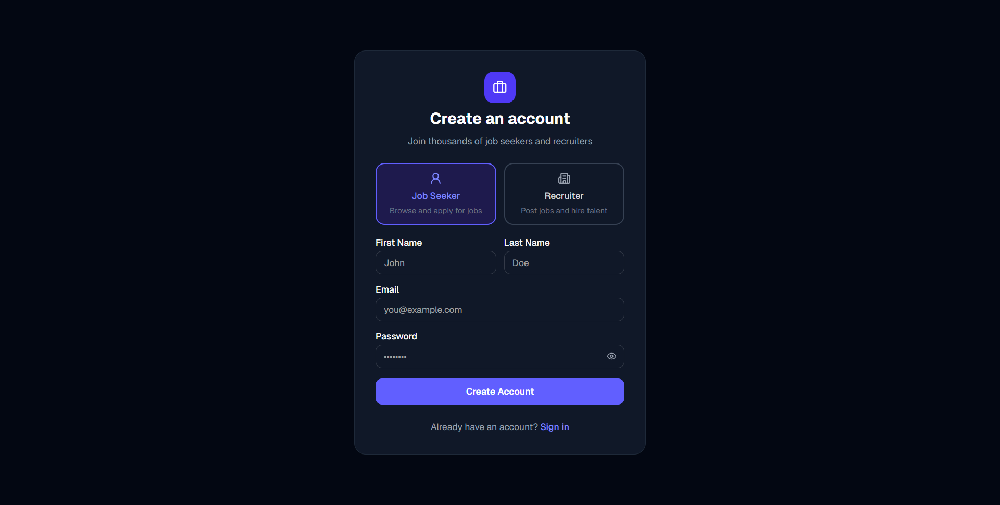

### Seeker — Jobs
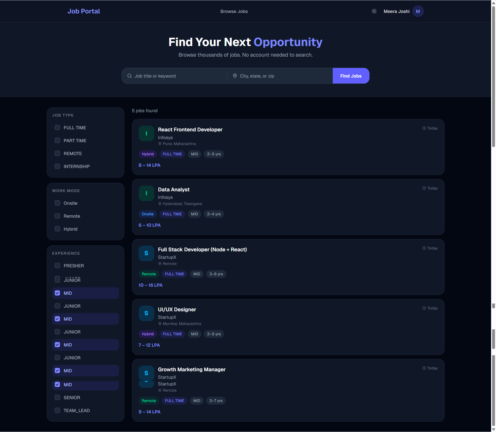

### Seeker — My Applications
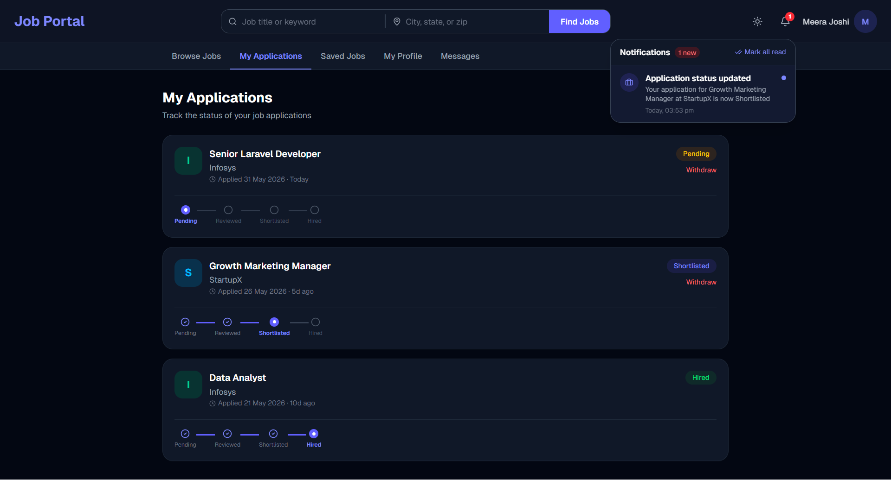

### Seeker — Saved Jobs
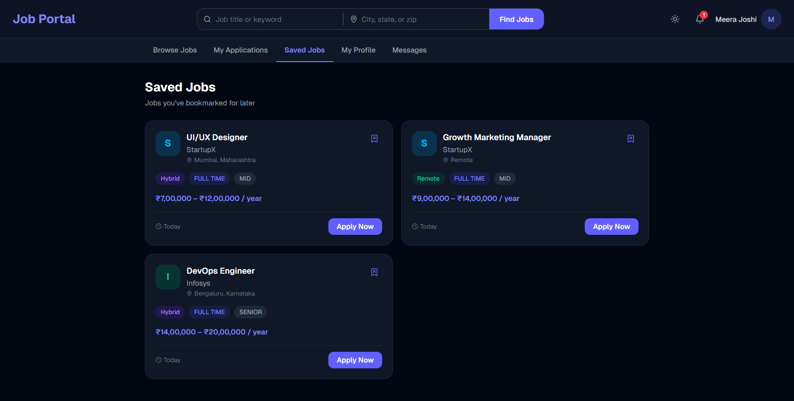

### Seeker — Profile
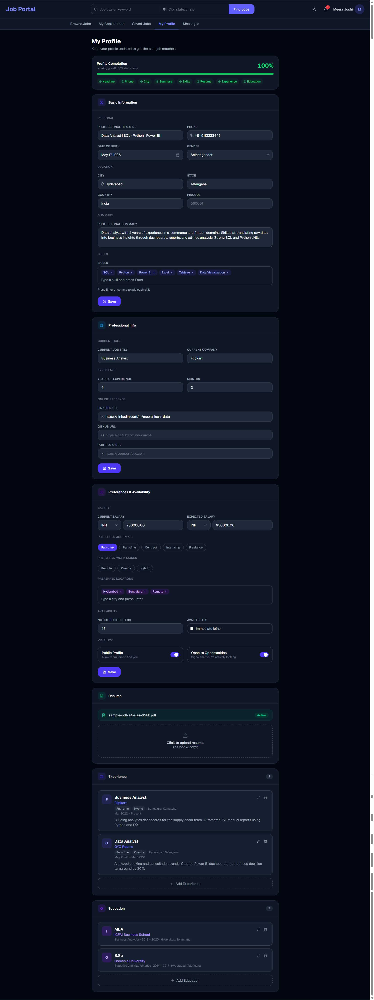

### Admin — Dashboard
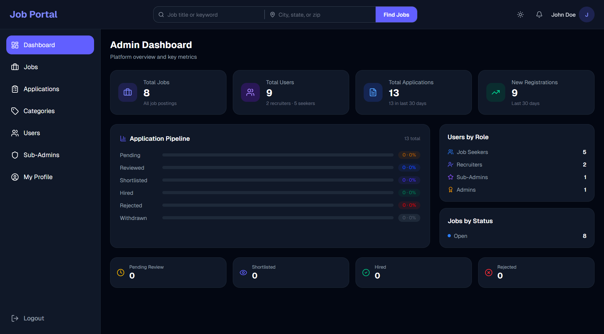

### Admin — Users
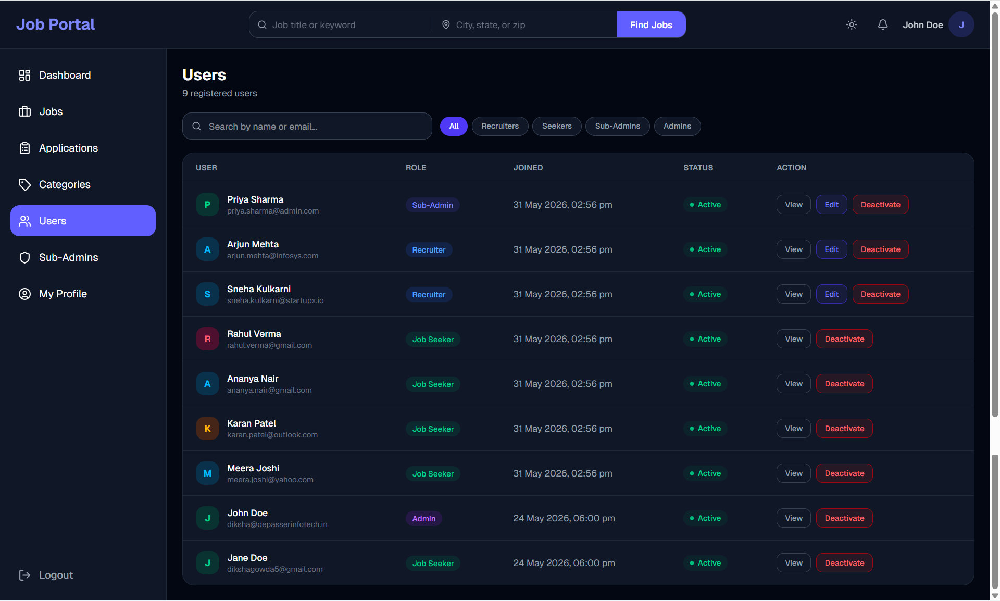

### Admin — Applications
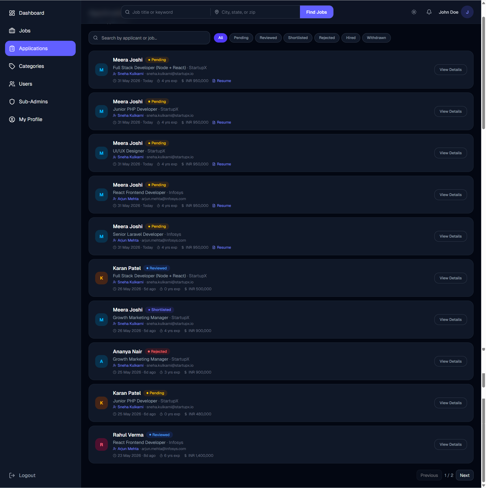

### Recruiter — My Jobs
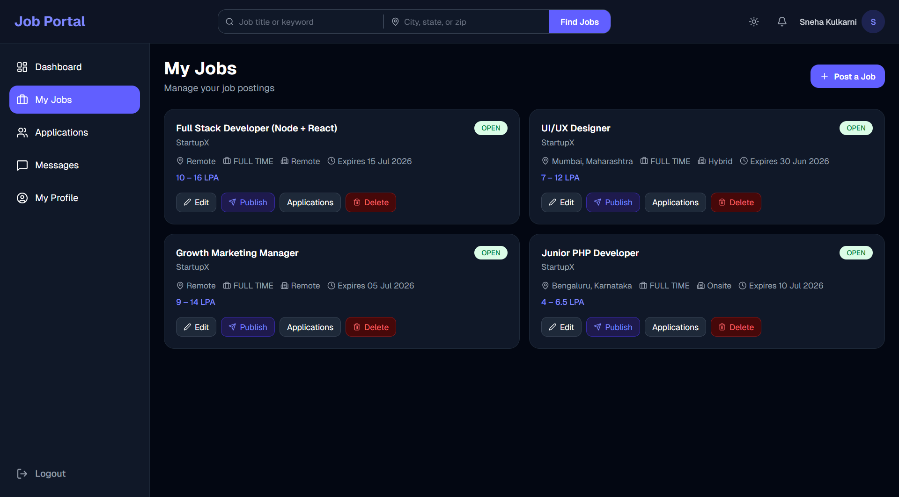

### Recruiter — Application Details
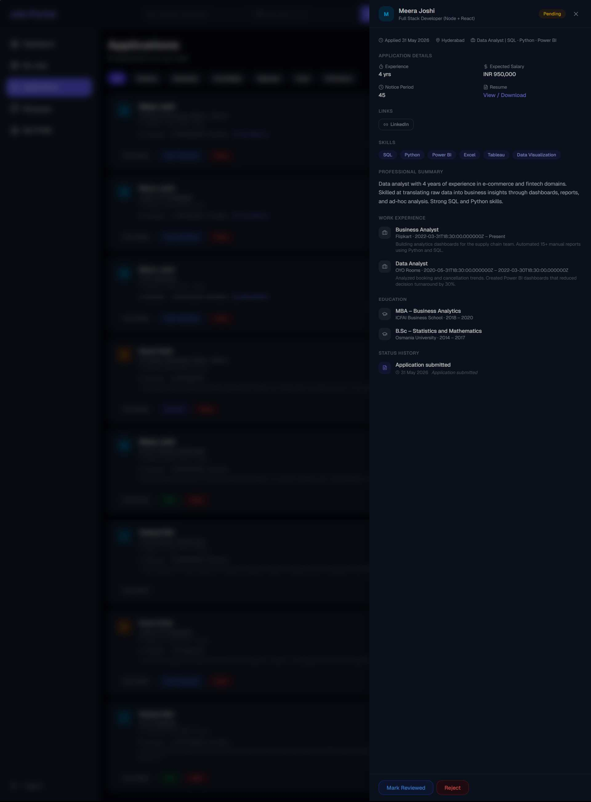
